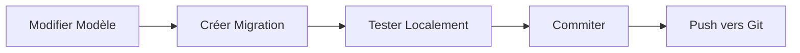
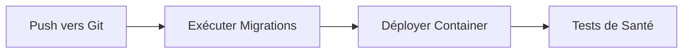

# 🔄 Guide des Migrations - SEEG-API

Guide complet pour gérer les migrations de base de données avec **Alembic**.

---

## 📋 Table des Matières

- [Qu'est-ce qu'une Migration ?](#quest-ce-quune-migration)
- [Scripts Disponibles](#scripts-disponibles)
- [Utilisation](#utilisation)
- [Workflow de Développement](#workflow-de-développement)
- [Résolution de Problèmes](#résolution-de-problèmes)

---

## 🤔 Qu'est-ce qu'une Migration ?

Une **migration** est un script qui modifie la structure de la base de données (tables, colonnes, index, etc.) de manière contrôlée et versionnée.

### Pourquoi les Migrations ?

- ✅ **Traçabilité**: Historique complet des changements
- ✅ **Reversibilité**: Possibilité de revenir en arrière
- ✅ **Automatisation**: Déploiement cohérent sur tous les environnements
- ✅ **Collaboration**: Partage des changements avec l'équipe

---

## 📦 Scripts Disponibles

### 1. `run-migrations.ps1` (Windows)

Script PowerShell pour exécuter les migrations sur Azure.

**Usage**:
```powershell
# Exécuter directement
.\scripts\run-migrations.ps1

# Ou via mise à jour
.\scripts\mise_a_jour.ps1
# Répondre "y" quand demandé
```

---

### 2. `run-migrations.sh` (Linux/Mac)

Script Bash pour exécuter les migrations sur Azure.

**Usage**:
```bash
# Rendre exécutable
chmod +x scripts/run-migrations.sh

# Exécuter directement
./scripts/run-migrations.sh

# Ou via mise à jour
./scripts/mise_a_jour.sh
# Répondre "y" quand demandé
```

---

## 🚀 Utilisation

### Scénario 1: Première Migration (Nouveau Projet)

**Sur Azure**:
```powershell
# Windows
.\scripts\run-migrations.ps1
```

```bash
# Linux/Mac
./scripts/run-migrations.sh
```

---

### Scénario 2: Ajouter une Migration

**En local**:
```bash
# 1. Modifier le modèle (ex: app/models/user.py)
class User(Base):
    # ... existing fields ...
    phone_number = Column(String(20), nullable=True)  # Nouveau champ

# 2. Créer la migration
alembic revision --autogenerate -m "add phone number to users"

# 3. Vérifier le fichier généré
cat app/db/migrations/versions/xxxxx_add_phone_number_to_users.py

# 4. Tester en local
alembic upgrade head

# 5. Commiter
git add app/db/migrations/versions/
git commit -m "Add phone number field to users"
git push
```

**Sur Azure** (après déploiement):
```powershell
# Windows
.\scripts\run-migrations.ps1
```

---

### Scénario 3: Mise à Jour avec Migrations

Le workflow complet :

**Windows**:
```powershell
# 1. Modifier le code et créer les migrations en local
alembic revision --autogenerate -m "description"

# 2. Tester en local
alembic upgrade head

# 3. Commiter et push
git add .
git commit -m "Update: ..."
git push

# 4. Déployer sur Azure (avec prompt pour migrations)
.\scripts\mise_a_jour.ps1
# Répondre "y" pour exécuter les migrations
```

**Linux/Mac**:
```bash
# 1. Modifier le code et créer les migrations en local
alembic revision --autogenerate -m "description"

# 2. Tester en local
alembic upgrade head

# 3. Commiter et push
git add .
git commit -m "Update: ..."
git push

# 4. Déployer sur Azure (avec prompt pour migrations)
./scripts/mise_a_jour.sh
# Répondre "y" pour exécuter les migrations
```

---

### Scénario 4: Rollback (Revenir en Arrière)

**En local**:
```bash
# Voir l'historique
alembic history

# Revenir à une version spécifique
alembic downgrade -1  # Revenir d'une version
alembic downgrade <revision_id>  # Revenir à une révision spécifique
alembic downgrade base  # Revenir au début (DANGER!)
```

**Sur Azure** (via SSH):
```bash
# Se connecter à l'App Service
az webapp ssh --name one-hcm-seeg-backend --resource-group one-hcm-seeg-rg

# Exécuter le rollback
cd /home/site/wwwroot
alembic downgrade -1
```

---

## 🔄 Workflow de Développement

### Développement Local



**Commandes**:
```bash
# 1. Activer l'environnement virtuel
source venv/bin/activate  # Linux/Mac
.\env\Scripts\activate    # Windows

# 2. Créer une migration
alembic revision --autogenerate -m "description du changement"

# 3. Vérifier le fichier généré
# Chemin: app/db/migrations/versions/<timestamp>_description.py

# 4. Appliquer en local
alembic upgrade head

# 5. Vérifier que ça fonctionne
python -m pytest

# 6. Commiter
git add app/db/migrations/versions/
git commit -m "Migration: description du changement"
```

---

### Déploiement en Production



**Commandes**:
```powershell
# Windows
git push origin main
.\scripts\mise_a_jour.ps1  # Répondre "y" pour migrations
```

```bash
# Linux/Mac
git push origin main
./scripts/mise_a_jour.sh  # Répondre "y" pour migrations
```

---

## 🛠️ Commandes Alembic Utiles

### Voir l'Historique

```bash
# Historique complet
alembic history

# Historique détaillé
alembic history --verbose

# État actuel
alembic current
```

### Créer des Migrations

```bash
# Migration automatique (recommandé)
alembic revision --autogenerate -m "description"

# Migration manuelle (vide)
alembic revision -m "description"
```

### Appliquer des Migrations

```bash
# Appliquer toutes les migrations en attente
alembic upgrade head

# Appliquer jusqu'à une révision spécifique
alembic upgrade <revision_id>

# Appliquer une migration de plus
alembic upgrade +1
```

### Annuler des Migrations

```bash
# Revenir d'une migration
alembic downgrade -1

# Revenir à une révision spécifique
alembic downgrade <revision_id>

# DANGER: Tout supprimer
alembic downgrade base
```

---

## 🔍 Vérifications Importantes

### Avant de Créer une Migration

```bash
# 1. Vérifier que les modèles sont corrects
python -c "from app.models import *"

# 2. Vérifier l'état actuel
alembic current

# 3. Créer la migration
alembic revision --autogenerate -m "description"

# 4. TOUJOURS vérifier le fichier généré
cat app/db/migrations/versions/<latest>.py
```

### Points à Vérifier dans le Fichier de Migration

- ✅ Les `upgrade()` et `downgrade()` sont cohérents
- ✅ Pas de suppression accidentelle de données
- ✅ Les types de colonnes sont corrects
- ✅ Les contraintes sont appropriées
- ✅ Les index sont définis si nécessaire

---

## ❌ Résolution de Problèmes

### Erreur: "Target database is not up to date"

**Cause**: La base de données n'est pas à jour.

**Solution**:
```bash
alembic upgrade head
```

---

### Erreur: "Can't locate revision identified by 'xxxxx'"

**Cause**: Fichier de migration manquant.

**Solution**:
```bash
# Vérifier les fichiers
ls app/db/migrations/versions/

# Re-pull depuis Git
git pull origin main
```

---

### Erreur: "Multiple head revisions are present"

**Cause**: Plusieurs branches de migration.

**Solution**:
```bash
# Fusionner les heads
alembic merge heads -m "merge migrations"
alembic upgrade head
```

---

### Erreur de Connexion à la Base de Données

**Sur Azure**:
```bash
# Vérifier les variables d'environnement
az webapp config appsettings list \
  --name one-hcm-seeg-backend \
  --resource-group one-hcm-seeg-rg \
  --query "[?name=='DATABASE_URL'].value"

# Tester la connexion
az webapp ssh --name one-hcm-seeg-backend --resource-group one-hcm-seeg-rg
# Dans le shell:
python -c "from app.db.database import engine; print('OK')"
```

---

### Migration Échoue sur Azure

**Diagnostic**:
```bash
# 1. Vérifier les logs
az webapp log tail \
  --name one-hcm-seeg-backend \
  --resource-group one-hcm-seeg-rg

# 2. Se connecter via SSH
az webapp ssh --name one-hcm-seeg-backend --resource-group one-hcm-seeg-rg

# 3. Exécuter manuellement
cd /home/site/wwwroot
alembic current
alembic upgrade head --sql  # Voir le SQL sans exécuter
alembic upgrade head  # Exécuter
```

---

## 📊 Bonnes Pratiques

### 1. Nommage des Migrations

```bash
# ❌ Mauvais
alembic revision --autogenerate -m "update"

# ✅ Bon
alembic revision --autogenerate -m "add email_verified to users"
alembic revision --autogenerate -m "create notifications table"
alembic revision --autogenerate -m "add index on user_email"
```

---

### 2. Tester Avant de Déployer

```bash
# Toujours tester en local
alembic upgrade head
python -m pytest

# Si OK, alors déployer
git push origin main
```

---

### 3. Backup Avant Migration Importante

**Sur Azure**:
```bash
# Créer un backup de la base de données
az postgres flexible-server backup create \
  --resource-group seeg-rg \
  --name seeg-postgres-server \
  --backup-name "before-migration-$(date +%Y%m%d)"
```

---

### 4. Migrations Reversibles

Toujours s'assurer que `downgrade()` fonctionne :

```python
def upgrade():
    op.add_column('users', sa.Column('phone', sa.String(20)))

def downgrade():
    op.drop_column('users', 'phone')
```

---

### 5. Migrations de Données

Pour des changements de données, créer une migration manuelle :

```python
from alembic import op

def upgrade():
    # Migration de structure
    op.add_column('users', sa.Column('full_name', sa.String(200)))
    
    # Migration de données
    op.execute("""
        UPDATE users 
        SET full_name = CONCAT(first_name, ' ', last_name)
        WHERE full_name IS NULL
    """)

def downgrade():
    op.drop_column('users', 'full_name')
```

---

## 🔐 Sécurité

### Variables Sensibles

```bash
# ❌ JAMAIS dans les migrations
password = "hardcoded_password"

# ✅ Utiliser les variables d'environnement
from app.core.config import settings
database_url = settings.DATABASE_URL
```

---

## 📞 Support

### Commandes de Debug

```bash
# État actuel
alembic current

# Historique
alembic history

# Voir le SQL sans exécuter
alembic upgrade head --sql

# Logs détaillés
alembic -x echo=true upgrade head
```

### Ressources

- **Documentation Alembic**: https://alembic.sqlalchemy.org/
- **SQLAlchemy**: https://docs.sqlalchemy.org/
- **Azure CLI**: https://docs.microsoft.com/cli/azure/

---

## 📝 Checklist de Migration

Avant chaque migration en production :

- [ ] Migration testée en local
- [ ] Tests unitaires passent
- [ ] Fichier de migration vérifié manuellement
- [ ] `downgrade()` implémenté et testé
- [ ] Backup de la base de données créé
- [ ] Notification à l'équipe
- [ ] Fenêtre de maintenance planifiée (si nécessaire)
- [ ] Plan de rollback préparé

---

**Dernière mise à jour**: 2025-10-02  
**Version**: 1.0.0  
**Mainteneur**: Sevan Kedesh IKISSA

